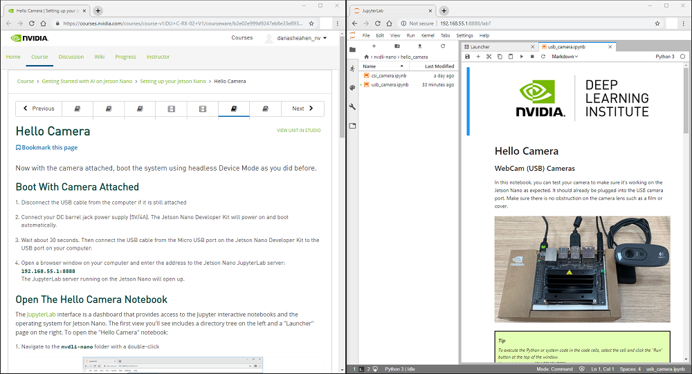

# Getting Started with AI on Jetson Nano

## Welcome

Welcome to Getting Started with AI on Jetson Nano! In this course, you will build AI projects on your own NVIDIA® Jetson Nano. You'll learn how to:

- Set up your Jetson Nano Developer Kit and camera to run this course
- Collect varied data for image classification projects
- Train neural network models for classification
- Annotate image data for regression
- Train neural network models for regression to localize features
- Run inference on a live camera feed with your trained models

### Working through the course

Throughout the course you'll work in two browser windows. The first window is the one you are viewing now. It contains the course pages you'll use for a guided learning experience, hosted on the [NVIDIA® Deep Learning Institute](https://www.nvidia.com/en-us/deep-learning-ai/education/) (DLI) platform. This is where you'll find instructions, references, and quizzes. You can also track your progress toward earning a Certificate of Competency for the course.

The second browser window contains a remote JupyterLab interface into your Jetson Nano. You'll begin with some hardware setup in the [Setting up your Jetson Nano](./setting-up-your-jetson-nano/README.md) section, and then open this window in your computer browser. This JupyterLab window is where you'll run Python code interactively in [Jupyter](https://jupyter.org/) notebooks to view the camera feed and build your AI Classification and Regression projects. The Jupyter notebooks you'll work with are easy to copy, change, experiment with, and extend for your own additional projects whenever you are ready to do so!

## Course Outline

The course consists of three main sections. Use the navigation and breadcrumb links at the top of each section to step through the lessons.

[<h2>1. Setting Up Your Jetson Nano</h2>](./setting-up-your-jetson-nano/README.md)

Step-by-step guide to set up your hardware and software for the course projects

- Introduction and Setup

  Video walk-through and instructions for setting up JetPack and what items you need to get started

- Cameras

  Details on how to connect your camera to the Jetson Nano Developer Kit

- Headless Device Mode

  Video walk-through and instructions for running the Docker container for the course using headless device mode (remotely from your computer).

- Hello Camera

  How to test your camera with an interactive Jupyter notebook on the Jetson Nano Developer Kit

- JupyterLab

  A brief introduction to the JupyterLab interface and notebooks

[<h2>2. Image Classification</h2>](./image-classification/README.md)

Background information and instructions to create projects that classify images using Deep Learning

- AI and Deep Learning

  A brief overview of Deep Learning and how it relates to Artificial Intelligence (AI)

- Convolutional Neural Networks (CNNs)

  An introduction to the dominant class of artificial neural networks for computer vision tasks

- ResNet-18

  Specifics on the ResNet-18 network architecture used in the class projects

- Thumbs Project

  Video walk-through and instructions to work with the interactive image classification notebook to create your first project

- Emotions Project

  Build a new project with the same classification notebook to detect emotions from facial expressions

- Quiz Questions

  Answer questions about what you've learned to reinforce your knowledge

[<h2>3. Image Regression</h2>](./image-regression/README.md)

Instructions to create projects that can localize and track image features in a live camera image

- Classification vs. Regression

  With a few changes, your the Classification model can be converted to a Regression model

- Face XY Project

  Video walk-through and instructions to build a project that finds the coordinates of facial features

- Quiz Questions

  Answer questions about what you've learned to reinforce your knowledge
