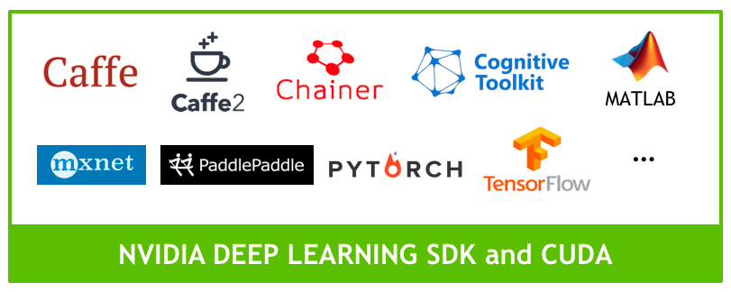

# Outline

- [Outline](#outline)
- [AI And Deep Learning](#ai-and-deep-learning)
  - [AI and Deep Learning](#ai-and-deep-learning-1)
  - [Deep Learning Models](#deep-learning-models)
- [Convolutional Neural Networks (CNNs)](#convolutional-neural-networks-cnns)
  - [Artificial Neural Network](#artificial-neural-network)
  - [Convolutions](#convolutions)
  - [Accelerating CNNs using GPUs](#accelerating-cnns-using-gpus)
- [ResNet-18](#resnet-18)
  - [Residual Networks](#residual-networks)
  - [Transfer Learning](#transfer-learning)
- [Thumbs Project](#thumbs-project)
  - [Image Classification Project](#image-classification-project)
  - [Interactive Tool Startup Steps](#interactive-tool-startup-steps)
    - [Step 1: Open the notebook](#step-1-open-the-notebook)
    - [Step 2: Execute all of the code blocks](#step-2-execute-all-of-the-code-blocks)
    - [Step 3: Collect your initial data](#step-3-collect-your-initial-data)
    - [Step 4: Train your initial data](#step-4-train-your-initial-data)
    - [Step 5: Test your data in real time](#step-5-test-your-data-in-real-time)
    - [Step 6: Improve your model](#step-6-improve-your-model)
    - [Step 7: Save your model](#step-7-save-your-model)
- [Emotions Project](#emotions-project)
  - [Interactive Tool Startup Steps](#interactive-tool-startup-steps-1)
    - [Step 1: Open the notebook](#step-1-open-the-notebook-1)
    - [Step 2: Modify the Task code cell](#step-2-modify-the-task-code-cell)
    - [Step 3: Execute all of the code blocks](#step-3-execute-all-of-the-code-blocks)
    - [Step 4: Collect Data, Train, Test](#step-4-collect-data-train-test)
    - [Step 5: Improve your model](#step-5-improve-your-model)
    - [Step 5: Save your model](#step-5-save-your-model)
  - [More Classification Projects](#more-classification-projects)
- [Assessment](#assessment)

# AI And Deep Learning

In this course, you'll build AI projects that can answer simple visual questions:

- Is my hand showing thumbs-up or thumbs-down?
- Does my face appear happy or sad?
- How many fingers am I holding up?
- Where's my nose?

Although these questions are easy for any human child to answer, interpreting images with computer vision requires a complex computer model that can be tuned to find the answer in a number of scenarios. For example, a thumbs-up hand signal may be at various angles and distances from the camera, it may be held before a variety of backgrounds, it could be from a variety of different hands, and so on, but it is still a thumbs-up hand signal. An effective AI model must be able to generalize across these scenarios, and even predict the correct answer with new data.

## AI and Deep Learning

As humans, we generalize what we see based on our experience. In a similar way, we can use a branch of AI called Machine Learning to generalize and classify images based on experience in the form of lots of example data. In particular, we will use deep neural network models, or Deep Learning to recognize relevant patterns in an image dataset, and ultimately match new images to correct answers.

<p align="center">

</p>

If you want to know more, you can check out [this article](https://blogs.nvidia.com/blog/2016/07/29/whats-difference-artificial-intelligence-machine-learning-deep-learning-ai/) about the differences between Artificial Intelligence, Machine Learning, and Deep Learning.

## Deep Learning Models

A Deep Learning model consists of a neural network with internal parameters, or `weights`, configured to map inputs to outputs. In `Image Classification`, the inputs are the pixels from a camera image and the outputs are the possible categories, or `classes` that the model is trained to recognize. The choices might be 1000 different objects, or only two. Multiple labeled examples must be provided to the model over and over to train it to recognize the images. Once the model is trained, it can be run on live data and provide results in real time. This is called `inference`.

<p align="center">

</p>

Before training, the model cannot accurately determine the correct class from an image input, because the weights are wrong. Labeled examples of images are iteratively submitted to the network with a learning algorithm. If the network gets the "wrong" answer (the label doesn't match), the learning algorithm adjusts the weights a little bit. Over many computationally intensive iterations, the accuracy improves to the point that the model can reliably determine the class for an input image.

As you will discover, the data that is input is one of the keys to a good model, i.e. one that generalizes well regardless of the background, angle, or other "noisy" aspect of the image presented. Additional passes through the data set, or `epochs` can also improve the model's performance.

# Convolutional Neural Networks (CNNs)

Deep learning relies on [Convolutional Neural Network](https://developer.nvidia.com/discover/convolutional-neural-network) (CNN) models to transform images into predicted classifications. A CNN is a class of [artificial neural network](https://developer.nvidia.com/discover/artificial-neural-network) that uses convolutional layers to filter inputs for useful information, and is the preferred network for image applications

## Artificial Neural Network

An artificial neural network is a biologically inspired computational model that is patterned after the network of neurons present in the human brain. At each layer, the network transforms input data by applying a nonlinear function to a weighted sum of the inputs. The intermediate outputs of one layer, called features, are used as the input into the next layer. The neural network, through repeated transformations, learns multiple layers of nonlinear features (like edges and shapes), which it then combines in a final layer to create a prediction (of more complex objects).

<p align="center">

</p>

## Convolutions

The convolution operation specific to CNNs combines the input data (feature map) from one layer with a convolution kernel (filter) to form a transformed feature map for the next layer. CNNs for image classification are generally composed of an input layer (the image), a series of hidden layers for feature extraction (the convolutions), and a fully connected output layer (the classification).

<p align="center">

</p>

> Figure 1: An input image of a traffic sign is filtered by 4 5x5 convolutional kernels which create 4 feature maps, these feature maps are subsampled by max pooling. The next layer applies 10 5x5 convolutional kernels to these subsampled images and again we pool the feature maps. The final layer is a fully connected layer where all generated features are combined and used in the classifier (essentially logistic regression). Image by Maurice Peemen.

As it is trained, the CNN adjusts automatically to find the most relevant features based on its classification requirements. For example, a CNN would filter information about the shape of an object when confronted with a general object recognition task but would extract the color of the bird when faced with a bird recognition task. This is based on the CNN's recognition through training that different classes of objects have different shapes but that different types of birds are more likely to differ in color than in shape.

## Accelerating CNNs using GPUs

The extensive calculations required for training CNN models and running inference through trained CNN models can be quite large in number, requiring intensive compute resources and time. [Deep learning](https://developer.nvidia.com/deep-learning) frameworks such as Caffe, TensorFlow, and PyTorch, are optimized to run faster on GPUs. The frameworks take advantage of the parallel processing capabilities of a GPU if it is present, speeding up training and inference tasks.

<p align="center">

</p>

The Jetson Nano includes a 128-core NVIDIA Maxwell GPU. Since it can run the full training frameworks, it is also able to re-train networks with [transfer learning](https://blogs.nvidia.com/blog/2019/02/07/what-is-transfer-learning/), a capability you will use in the projects for this course. Jetson Nano enables you to experiment with deep learning and AI on a low-cost platform. See [this article](https://devblogs.nvidia.com/jetson-nano-ai-computing/) for more details on Jetson Nano performance.

# ResNet-18

There are a number of world-class CNN architectures available to application developers for image classification and image regression. PyTorch and other frameworks include access to pretrained models from past winners of the famous Imagenet Large Scale Visual Recognition Challenge (ILSVRC), where researchers compete to correctly classify and detect objects and scenes with computer vision algorithms. In 2015, ResNet swept the awards in image classification, detection, and localization. We'll be using the smallest version of ResNet in our projects: ResNet-18.

<p align="center">

</p>

## Residual Networks

The [Deep Residual Learning for Image Recognition](https://arxiv.org/pdf/1512.03385.pdf) research paper provides insight into why this architecture is effective. ResNet is a `residual network`, made with building blocks that incorporate "shortcut connections" that skip one or more layers.

<p align="center">

</p>

The shortcut output is added to the outputs of the skipped layers. The authors demonstrate that this technique makes the network easier to optimize, and have higher accuracy gains at greatly increased depths. The ResNet architectures presented range from 18-layers deep, all the way to 152-layers deep! For our purposes, the smallest network, ResNet-18 provides a good balance of performance and efficiency sized well for the Jetson Nano.

## Transfer Learning

PyTorch includes a pre-trained ResNet-18 model that was trained on the [ImageNet 2012 classification dataset](http://image-net.org/challenges/LSVRC/2012/browse-synsets), which consists of 1000 classes. In other words, the model can recognize 1000 different objects already!

Within the trained neural network are layers that find outlines, curves, lines, and other identifying features of an image. Important image features that were already learned in the original training of the model are now re-usable for our own classification task.

<p align="center">

</p>

We will adapt it for our projects, which all include less than 10 different classes, by modifying the last neural network layer of the 18 that make up the ResNet-18 model. The last layer for ResNet-18 is a `fully connected (fc)` layer, pooled and flattened to 512 inputs, each connected to the 1000 possible output classes. We will replace the (512,1000) layer with one matching our classes. If we only need three classes, for example, this final layer will become (512, 3), where each of the 512 inputs is fully connected to each one of the 3 output classes.

You will still need to train the network to recognize those three classes using images you collect, but since the network has already learned to recognize features common to most objects, training is already part-way done. The previous training can be reused, or "transferred" to your new projects.

# Thumbs Project

## Image Classification Project

The goal of this exercise is to build an Image Classification project that can determine the meaning of hand signals ( thumbs-up or thumbs-down) that are held in front of a live camera.

<p align="center">

</p>

## Interactive Tool Startup Steps

You will implement the project by collecting your own data, training a model to classify your data, and then testing and updating your model as needed until it correctly classifies thumbs-up or thumbs-down images before the live camera.

### Step 1: Open the notebook

To get started, navigate to the classification folder in your JupyterLab interface and double-click the `classification_interactive.ipynb` notebook to open it.

### Step 2: Execute all of the code blocks

The notebook is designed to be reusable for any classification task you wish to build. Step through the code blocks and execute them one at a time. If you have trouble with this step, review the information on [JupyterLab](../setting-up-your-jetson-nano/README.md#jupyterlab).

<h4>1. Camera</h4>

This block sets the size of the images and starts the camera. If your camera is already active in this notebook or in another notebook, first shut down the kernel in the active notebook before running this code cell. Make sure that the correct camera type is selected for execution (USB). This cell may take several seconds to execute.

<h4>2. Task</h4>

You get to define your `TASK` and `CATEGORIES` (the classes) parameters here, as well as how many datasets you want to track. For the Thumbs Project, this has already been defined for you, so go ahead and execute the cell. Subdirectories for each class are created to store the example images you collect. The subdirectory names serve as the labels needed for the model. This cell should only take a few seconds to execute.

<h4>3. Data Collection</h4>

You'll collect images for your categories with your camera using an iPython widget. This cell sets up the collection mechanism to count your images and produce the user interface. The widget built here is the `data_collection_widget`. If you want to learn more about these powerful tools, visit the [ipywidgets documentaion](https://ipywidgets.readthedocs.io/en/stable/). This cell should only take a few seconds to execute.

<h4>4. Model</h4>

This block is where the neural network is defined. First, the GPU device is chosen with the statement:

```py
device = torch.device('cuda')
```

The model is set to the ResNet-18 model for this project. Note that the `pretrained=True` parameter indicates we are loading all the parameter weights for the trained Resnet-18 model, not just the neural network alone:

```py
model = torchvision.models.resnet18(pretrained=True)
```

There are a few more models listed in comments that you can try out later if you wish. For more information on available PyTorch pre-trained models, see the [PyTorch documentation](https://pytorch.org/docs/stable/torchvision/models.html#classification).

In addition to choosing the model, the last layer of the model is modified to accept only the number of classes that we are training for. In the case of the Thumbs Project, it is only 2 (i.e. _thumbs-up_ and _thumbs-down_).

```py
model.fc = torch.nn.Linear(512, len(dataset.categories))
```

This code cell may take several seconds to execute.

<H4>5. Live Execution</h4>

This code block sets up threading to run the model in the background so that you can view the live camera feed and visualize the model performance in real time. It also includes the code that defines how the outputs from the neural network are categorized. The network produces some value for each of the possible categories. The `softmax function` takes this vector of _K_ real numbers, and normalizes it into a probability distribution consisting of _K_ probabilities. The values now add up to 1 and can be interpreted as probabilities.

```py
output = F.softmax(output, dim=1).detach().cpu().numpy().flatten()
```

This cell should only take a few seconds to execute.

<h4>6. Training and Evaluation</h4>

The training code cell sets the hyper-parameters for the model training (number of epochs, batch size, learning rate, momentum) and loads the images for training or evaluation. The model determines a predicted output from the loaded input image. The difference between the predicted output and the actual label is used to calculate the "loss". If the model is in training mode, the loss is backpropagated into the network to improve the model. The widgets created by this code cell include the option for setting the number of epochs to run. One epoch is a complete cycle of all images through the trainer. This code cell may take several seconds to execute.

<h4>7. Display the Interactive Tool!</h4>

This is the last code cell. All that's left to do is pack all the widgets into one comprehensive tool and display it. This cell may take several seconds to run and should display the full tool for you to work with. This tool will look essentially the same, no matter how you set up the classification problem with this notebook.

<p align="center">

</p>

### Step 3: Collect your initial data

The tool is designed for live interaction, so you can collect some data, train it, check the results, and then improve the model with more data and training. We'll try this in pieces to learn what effect the data you gather has on performance of the model. At each step, you'll vary the data in a new way, building your dataset as you go.

Collect 30 images of _thumbs-up_ images. Move your thumb through an arc of generally upward angles in front of the camera as you click the "add" button to save the data images.

<p align="center">

</p>

Next, select the _thumbs-down_ category on the tool

<p align="center">

</p>

and collect 30 images of your thumb in the down position, again varying the angle a bit as you click. The goal is to provide the model with lots of different examples from each category, so that the prediction can be generalized.

### Step 4: Train your initial data

Set the epoch number to 10, and click the train button. There will be a delay of about 30 seconds as the trainer loads the data. After that, the progress bar will indicate training status for each epoch. You'll see the calculated loss and accuracy displayed as well. With each epoch, the model improves, at least based on the data it has to work with! The accuracy should generally increase. Keep in mind that the accuracy is based on tests against the data the model already has access to, not truly unseen data.

<p align="center">

</p>

### Step 5: Test your data in real time

Once training is done, hold your thumb up or down in front of the camera and observe the prediction and sliders. The sliders indicate the probability the model gives for the prediction made. How was the result? Are you satisfied that the model is robust? Try moving the camera to a new background to see if it still works the same.

> **Note**: If at any time your camera seems to "freeze", it will be necessary to shut down the kernel from the menu bar, then restart the kernel and run all cells. Your data is saved, but the model training will need to be run again

### Step 6: Improve your model

- Using a different background, gather an additional 30 images for thumbs-up and thumbs-down, again varying the angle. Train an additional 5 epochs.
- Did your model become more reliable? What happens when you move the thumb to corners and edges of the camera view, or move your thumb very far away or very close to the camera?
- Using a variety of distances from the camera, gather an additional 30 images for thumbs-up and thumbs-down. Train an additional 5 epochs.
- Keep testing and training in this way until you are satisfied with the performance of your first project!

### Step 7: Save your model

When you are satisfied with your model, save it by entering a name in the "model path" box and click "save model".

# Emotions Project

The goal of this exercise is to build an Image Classification project that can determine the meaning of four different facial expressions ("happy", "sad", "angry", "none"), that you provide in front of a live camera.

## Interactive Tool Startup Steps

The setup for the Emotions Project is almost the as for the Thumbs Project.

### Step 1: Open the notebook

You'll use the same `classification_interactive.ipynb` notebook. If it's already open, restart the notebook and clear all the outputs using the Kernel menu with `Kernel->Restart Kernel and Clear All Outputs`. If your camera is active in any other notebook, shut down the kernel in that active notebook as well.

### Step 2: Modify the Task code cell

Before you execute all of the code blocks in the notebook, you'll need to change the `TASK` and `CATEGORIES` parameters in the Task code cell block to define the new project. Comment out the "thumbs" project parameters, and uncomment the "emotions" parameters:

```py
# TASK = 'thumbs'
TASK = 'emotions'
# TASK = 'fingers'
# TASK = 'diy'

# CATEGORIES = ['thumbs_up', 'thumbs_down']
CATEGORIES = ['none', 'happy', 'sad', 'angry']
# CATEGORIES = ['1', '2', '3', '4', '5']
# CATEGORIES = [ 'diy_1', 'diy_2', 'diy_3']
```

### Step 3: Execute all of the code blocks

The rest of the blocks remain the same. You'll still use the ResNet18 pre-trained model as a base. This time, since there are four items in the `CATEGORIES` parameter, there will be four different class subdirectories for data and four output probability sliders on the Interactive tool.

<p align="center">

</p>

### Step 4: Collect Data, Train, Test

Position the camera in front of your face and collect initial data. As you collect each emotion, vary your head position and pose. Try leaning your head left and right, up and down, side to side. As you create your emotion faces, think about the difference between _sad_ and _angry_. Exaggerate Your expressions to make them distinctive for the initial training, then refine with more subtlety as you as your model improves:

1. Add 20 images of a "happy" face with the happy category selected
2. Add 20 images of a "sad" face with the sad category selected
3. Add 20 images of an "angry" face with the angry category selected
4. Add 20 images of a face with no expression with the none category selected
5. Set the number of epochs to 10 and click the train button
6. Once the training is complete, try different expressions live and observe the prediction

### Step 5: Improve your model

As you did in the Thumbs Project, you can improve your model by adding data for scenarios that don't work as well as you like, then retraining. For example:

- Move the camera so that the face is closer. Is the performance of the predictor still good? If not, try adding some data for each category (10 each) and retrain (5 epochs). Does this help? You can experiment with more data and more training.
- Move the camera for a different background. Is the performance of the predictor still good? If not, try adding some data for each category (10 each) and retrain (5 epochs). Does this help? You can experiment with more data and more training.
- Can you get a friend to try your model? Does it work the same? You know the drill… more data and training!

### Step 5: Save your model

When you are satisfied with your model, save it by entering a name in the "model path" box and click "save model".

## More Classification Projects

To build another project, follow the pattern you did with the Emotions Project. As an example, the Fingers project is provided as an example, but don't let that limit you! To start a new project, save your previous work, modify the `TASK` and `CATEGORIES` values, shutdown and restart the notebook, and run all the cells. Then collect, train, and test!

# Assessment

<h3>Classification</h3>

What is "Classification" in Machine Learning?

- [ ] Mapping a group of inputs to discrete outputs
- [ ] Classifying an input to a given set of categories
- [ ] Predicting labels for input images
- [x] All of the above

<h3>Data Collection</h3>

What are the key points to keep in mind when collecting image data?

- [ ] Try to provide different backgrounds so that model learns essential features
- [ ] Vary the light settings, so that model learns color variance.
- [ ] Collect the data with minimum labeling errors so that the data set will have less outliers and noise.
- [x] All of the above

<h3>Classification Steps</h3>

What are the steps followed in the Classification Project?

- [ ] Train Model->Collect Data->Live Demonstration
- [x] Collect Data->Train Model->Live Demonstration
- [ ] Live Demonstration->Train Data->Collect Data
- [ ] None of the above

<h3>Framework</h3>

Which Deep Learning Framework was used to train the classification model?

- [ ] TensorFlow
- [ ] TensorRT
- [x] PyTorch
- [ ] MXNET
- [ ] None of the above

<h3>Transfer Learning</h3>

What is Transfer Learning?

- [ ] A. Use a pre-trained model so that we don’t have to train at all
- [x] B. Use a pre-trained model so that we only need to train on new datasets
- [ ] C. Do not use a pre-trained model, because that will reduce the accuracy for specific tasks
- [ ] D. Both options A and B

<h3>Network Layers</h3>

For our projects, we modified the last layer of a pre-trained ResNet-18 model. What kind of layer is it?

- [ ] MaxPool layer
- [ ] Convolution Layer
- [x] Fully Connected Layer
- [ ] Dropout Layer

<h3>Data Sets</h3>

We used a PyTorch provided pre-trained ResNet-18 architecture. What dataset was ResNet-18 pre-trained on?

- [ ] COCO
- [x] ImageNet
- [ ] MNIST
- [ ] CIFAR-100

<h3>CATEGORIES variable</h3>

There is a global variable named CATEGORIES in the notebook. If we add a new category to this list, how must the output dimension of the neural network change for this classification task?

- [ ] The output dimension will stay the same
- [x] The output dimension will increase by 1
- [ ] The output dimension will increase by 2
- [ ] The output dimension will increase by 4

<h3>Optimizer</h3>

What optimizer was used for training the model?

- [ ] Stochastic Gradient Descent
- [ ] Averaged Stochastic Gradient Descent
- [x] Adam
- [ ] AdaGrad

<h3>Numerical Input</h3>

How many classes did the Image Classification "Emotions Project" include?

- [x] 4
