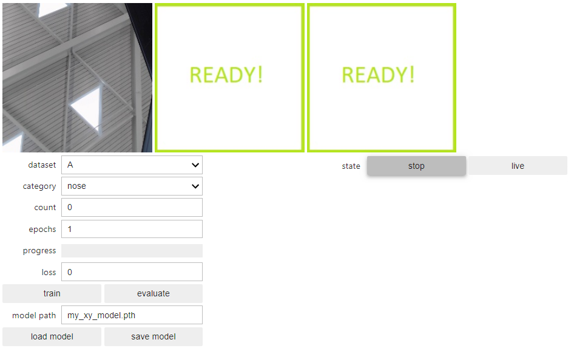

# Outline

- [Outline](#outline)
- [Classification Vs. Regression](#classification-vs-regression)
  - [Continuous Outputs](#continuous-outputs)
  - [Changing the final layer](#changing-the-final-layer)
  - [Evaluation](#evaluation)
- [Face XY Project](#face-xy-project)
  - [Image Regression Project](#image-regression-project)
  - [Interactive Tool Startup Steps](#interactive-tool-startup-steps)
    - [Step 1: Open the notebook](#step-1-open-the-notebook)
    - [Step 2: Execute all of the code blocks](#step-2-execute-all-of-the-code-blocks)
    - [Step 3: Collect Data, Train, Test](#step-3-collect-data-train-test)
    - [Step 4: Improve your model](#step-4-improve-your-model)
    - [Step 5: Save your model](#step-5-save-your-model)
  - [More Regression Projects](#more-regression-projects)
- [Assessment](#assessment)

# Classification Vs. Regression

Unlike Image Classification applications, which map image inputs to `discrete` outputs (classes), the Image Regression task maps the image input pixels to `continuous` outputs.

## Continuous Outputs

In the course regression project, those continuous outputs happen to define the X and Y coordinates of various features on a face, such as a nose. Mapping an image stream to a location for tracking can be used in other applications, such as following a line in mobile robotics. Tracking isn't the only thing a Regression model can do though. The output values could be something quite different such as steering values, or camera movement parameters.

## Changing the final layer

The final layer of the pre-trained ResNet-18 network is a fully connected (fc) layer that has 512 inputs mapped to 1000 output classes, or (512, 1000). Using transfer learning in the Image Classification projects, that last layer was changed to only a few classes, depending on the application. For example, if there are to be 3 classes trained, we change the fc layer to (512, 3). The output includes the final layer of the neural network as a fully connected layer, with 512 inputs mapped to 3 classes.

In the case of a Regression project predicting coordinates, we want two values for each category, the X and Y values. That means twice as many outputs are required in the fc layer. For example, if there are 3 facial features (_nose_, _left_eye_, _right_eye_), each with both an X and Y output, then 6 outputs are required, or (512, 6) for the fc layer.

In classification, recall that the softmax function was used to build a probability distribution of the output values. For regression, we want to keep the actual values, because we didn't train for probabilities, but for actual X and Y output values.

## Evaluation

Classification and Regression also differ in the way they are evaluated. The discrete values of classification can be evaluated based on accuracy, i.e. a calculation of the percentage of "right" answers. In the case of regression, we are interested in getting as close as possible to a correct answer. Therefore, the root mean squared error can be used.

# Face XY Project

## Image Regression Project

The goal of this project is to build an Image Regression project that can predict the X and Y coordinates of a facial feature in a live image.

## Interactive Tool Startup Steps

You will implement the project by collecting your own data using a clickable image display tool, training a model to find the XY coordinates of the feature, and then testing and updating your model as needed using images from the live camera. Since you are collecting two values for each category, the model may require more training and data to get a satisfactory result.

> **Be patient!** Building your model is an iterative process.

### Step 1: Open the notebook

To get started, navigate to the regression folder in your JupyterLab interface and double-click the `regression_interactive.ipynb` notebook to open it.

### Step 2: Execute all of the code blocks

The notebook is designed to be reusable for any XY regression task you wish to build. Step through the code blocks and execute them one at a time.

<h4>1. Camera</h4>

This block sets the size of the images and starts the camera. If your camera is already active in this notebook or in another notebook, first shut down the kernel in the active notebook before running this code cell. Make sure that the correct camera type is selected for execution (USB). This cell may take several seconds to execute.

<h4>2. Task</h4>

You get to define your `TASK` and `CATEGORIES` parameters here, as well as how many datasets you want to track. For the Face XY Project, this has already been defined for you as the _face_ task with categories of _nose_, _left_eye_, and _right_eye_. Each category for the XY regression tool will require both an X and Y values. Go ahead and execute the cell. Subdirectories for each category are created to store the example images you collect. The file names of the images will contain the XY coordinates that you tag the images with during the data collection step. This cell should only take a few seconds to execute.

<h4>3. Data Collection</h4>

You’ll collect images for your categories with a special clickable image widget set up in this cell. As you click the “nose” or “eye” in the live feed image, the data image filename is automatically annotated and saved using the X and Y coordinates from the click.

<h4>4. Model</h4>

The model is set to the same pre-trained ResNet18 model for this project:

```py
model = torchvision.models.resnet18(pretrained=True)
```

For more information on available PyTorch pre-trained models, see the [PyTorch documentation](https://pytorch.org/docs/stable/torchvision/models.html#classification). In addition to choosing the model, the last layer of the model is modified to accept only the number of classes that we are training for. In the case of the Face XY Project, it is twice the number of categories, since each requires both X and Y coordinates (i.e. _nose X_, _nose Y_, _left_eye X_, _right_eye X_ and _right_eye Y_).

```py
output_dim = 2 \* len(dataset.categories)
model.fc = torch.nn.Linear(512, output_dim)
```

This code cell may take several seconds to execute.

<h4>5. Live Execution</h4>

This code block sets up threading to run the model in the background so that you can view the live camera feed and visualize the model performance in real time. This cell should only take a few seconds to execute. For this project,a blue circle will overlay the model prediction for the location of the feature selected.

<h4>6. Training and Evaluation</h4>

The training code cell sets the hyper-parameters for the model training (number of epochs, batch size, learning rate, momentum) and loads the images for training or evaluation. The regression version is very similar to the simple classification training, though the loss is calculated differently. The mean square error over the X and Y value errors is calculated and used as the loss for backpropagation in training to improve the model. This code cell may take several seconds to execute.

<h4>7. Display the Interactive Tool!</h4>

This is the last code cell. All that's left to do is pack all the widgets into one comprehensive tool and display it. This cell may take several seconds to run and should display the full tool for you to work with. There are three image windows. Initially, only the left camera feed is populated. The middle window will display the most recent annotated snapshot image once you start collecting data. The right-most window will display the live prediction view once the model has been trained.

<p align="center">

</p>

### Step 3: Collect Data, Train, Test

Position the camera in front of your face and collect initial data. Point to the target feature with the mouse cursor that matches the category you've selected (such as the nose). Click to collect data. The annotated snapshot you just collected will appear in the middle display box. As you collect each image, vary your head position and pose:

1. Add 20 images of your nose with the nose category selected
2. Add 20 images of your left eye face with the left_eye category selected
3. Add 20 images of your right eye with the right_eye category selected
4. Set the number of epochs to 10 and click the train button
5. Once the training is complete, try the live view and observe the prediction. A blue circle should appear on the feature selected.

### Step 4: Improve your model

Use the live inference as a guide to improve your model! The live feed shows the model's prediction. As you move your head, does the target circle correctly follow your nose (or left_eye, right_eye)? If not, then click the correct location and add data. After you've added some data for a new scenario, train the model some more. For example:

- Move the camera so that the face is closer. Is the performance of the predictor still good? If not, try adding some data for each category (10 each) and retrain (5 epochs). Does this help? You can experiment with more data and more training.
- Move the camera to provide a different background. Is the performance of the predictor still good? If not, try adding some data for each category (10 each) and retrain (5 epochs). Does this help? You can experiment with more data and more training.
- Are there any other scenarios you think the model might not perform well? Try them out!
- Can you get a friend to try your model? Does it work the same? You know the drill: more data and training!

### Step 5: Save your model

When you are satisfied with your model, save it by entering a name in the "model path" box and click "save model".

## More Regression Projects

To build another project, follow the pattern you did with the Face Project. Save your previous work, modify the `TASK` and `CATEGORIES` values, shutdown and restart the notebook, and run all the cells. Then collect, train, and test!

# Assessment

<h3>Classification vs Regression</h3>

What is the difference between Classification and Regression?

- [ ] They are the same
- [ ] Classification calculates forwards, while Regression calculates backwards
- [ ] Classification works with images but Regression can’t
- [x] Classification is used to predict discrete outputs while Regression is used to find continuous outputs

<h3>Regression Outputs</h3>

Assuming full training datasets are available and that all inputs are images or videos, which of the following output types would be good candidates for Image Regression? Check all that apply.

- [x] Speed and Steering control outputs in autonomous driving
- [ ] Outputs of "Good Weld" or "Bad Weld" in industrial inspection
- [x] Location coordinates of the nose on a face
- [ ] Dog breed identification

<h3>Images</h3>

What are the size and number of channels for a captured input image in the project?

- [x] Width=224, Height=224, Channels=3
- [ ] Width=224, Height=224, Channels=1
- [ ] Width=300, Height=300, Channels=3
- [ ] Width=300, Height=300, Channels=1

<h3>Architecture</h3>

Which Neural Network architecture was used for the Regression Task?

- [x] ResNet-18
- [ ] AlexNet
- [ ] MobileNet-V1
- [ ] PyTorch
- [ ] TensorFlow

<h3>Layers</h3>

How many layers does the ResNet-18 Architecture have?

- [x] 18 layers: 17 Convolutional layers and 1 Fully Connected layer
- [ ] 18 layers: 15 Convolutional layers and 3 Fully Connected layers
- [ ] 50 layers with 49 Convolutional layers and 1 Fully Connected layer
- [ ] 101 layers with 100 Convolutional layers and 1 Fully Connected layer

<h3>Python code: resnet18</h3>

What does the following line of Python code mean?

```py
model = models.resnet18(pretrained=True)
```

- [x] Define a ResNet-18 model with pre-trained weights (transfer learning)
- [ ] Define a ResNet-18 model for a classification task, such that no training is needed for the specific application
- [ ] Define the ResNet architecture, and require a parameter if the 18 layer specific architecture is needed
- [ ] Randomize the weights for a ResNet-18 model

<h3>Python code: fc</h3>

What does the following line of Python code do?

```py
model.fc = torch.nn.Linear(512, 5)
```

- [ ] Modifies convolutional layers with of model to accept 5 labels
- [x] Modifies the “Fully Connected” layer of the model to accept 5 labels
- [ ] Modifies the “First Convolution” layer of the model
- [ ] None of the above

<h3>CATEGORIES variable</h3>

There is a global variable named CATEGORIESin the XY regression notebook. If we add a new category to this list how must the output dimension of the neural network change for an (x,y) regression task?

- [ ] The output dimension will stay the same
- [ ] The output dimension will increase by 1
- [x] The output dimension will increase by 2
- [ ] The output dimension will increase by 4

<h3>Server GPUs</h3>

What is the difference between training deep learning models on a cloud/server-grade GPU vs Jetson Nano?

- [ ] Jetson Nano has fewer CUDA Cores than cloud servers do, which means it can do fewer operations in parallel.
- [ ] Jetson Nano has 472 GigaFLOPS whereas a Tesla GPU P100 (as an example) server-grade GPU has 18.7 TeraFLOPS, which means computations are much faster. Therefore, Jetson Nano is slower for Training deep learning architectures than server Grade GPU.
- [ ] Jetson Nano has 4GB memory whereas a Tesla GPU P100 (as an example) server-grade GPU has 16GB GPU memory. Therefore, server-grade GPUs allow processing of larger batch sizes.
- [x] All of the above

<h3>Numerical Input</h3>

How many outputs are required of the model to track the Nose position in the Face XY project?

- [x] 2
