# Introduction And Setup

# Outline

- [Introduction And Setup](#introduction-and-setup)
- [Outline](#outline)
  - [Setup Up JetPack](#setup-up-jetpack)
  - [Items for Getting Started](#items-for-getting-started)
  - [Additional Notes about Setup](#additional-notes-about-setup)
  - [Barrel Power Supply Setup (original 4G kit only)](#barrel-power-supply-setup-original-4g-kit-only)
- [Cameras](#cameras)
  - [Logitech C270 USB Webcam (recommended configuration)](#logitech-c270-usb-webcam-recommended-configuration)
  - [Raspberry Pi v2 Camera (Alternate Configuration)](#raspberry-pi-v2-camera-alternate-configuration)
  - [Other cameras](#other-cameras)
- [Headless Device Mode](#headless-device-mode)
  - [Download Docker and Start JupyterLab](#download-docker-and-start-jupyterlab)
  - [Headless Device Mode](#headless-device-mode-1)
  - [Setup Steps](#setup-steps)
  - [Logging into the JupyterLab server](#logging-into-the-jupyterlab-server)
- [Hello Camera](#hello-camera)
  - [Open the Hello Camera Notebook](#open-the-hello-camera-notebook)
- [JupyterLab](#jupyterlab)
  - [JupyterLab Interface](#jupyterlab-interface)

## Setup Up JetPack

The [NVIDIA® Jetson Nano™ Developer Kit](https://developer.nvidia.com/embedded/buy/jetson-nano-devkit) is a small AI computer for makers, learners, and developers. After following along with this guide, you’ll be ready to start building practical AI applications, cool AI robots, and more.

<p align="center">

</p>

## Items for Getting Started

To get started, you'll need to set up a microSD card for your operating system and main storage. Follow the NVIDIA instructions for either the original 4GB Jetson Nano Developer Kit or the new Jetson Nano 2GB Developer Kit to download and flash the latest JetPack image for your system. To specifically run this DLI course, which includes deep learning training with PyTorch on your Jetson Nano, you'll need to make the following modifications and additions to the items listed in the general setup instructions:

<h3>&#8226; 64GB microSD Card</h3>

We recommend a larger microSD card to ensure there is plenty of room for your applications and data.

<h3>&#8226; Internet Connection for your Jetson Nano</h3>

You'll need an Internet connection through either the Ethernet port or a compatible WiFi device the first time you run the course notebooks. You'll execute a command that downloads a Docker image from the NVIDIA NGC cloud. After that, as long as the Docker image is not deleted from your microSD card, you won't need the Internet connection on the Jetson Nano to run the course notebooks.

<h3>&#8226; USB Webcam</h3>

You'll need a camera to capture images in the course projects. As an example of a compatible camera, NVIDIA has verified that the Logitech C270 USB Webcam works with these projects. The ability to position the camera easily for capturing images hands-free makes this a great choice. Some other USB webcams may also work with the projects. If you already have one on hand, you could test it as an alternative.

<h3>&#8226; USB data cable (Micro-B to Type-A)</h3>

You'll also need a Micro USB to USB-A cable to directly connect your computer to the Jetson Nano Developer Kit's Micro USB port. The cable must be capable of data transfers, rather than only designed to power a device. This is a common cable available at many outlets if you don't already have one on hand.

<h3>&#8226; Original 4GB Version only: Alternate Power Supply</h3>

For this course, the 5V 4A DC barrel jack power supply is required. Although it is possible to power the original 4GB Jetson Nano with a smaller microUSB supply, this is not robust enough for the high GPU compute load we require for our projects. In addition, you will need the microUSB port available as a direct connection to your computer for this course.

<h4>&#8226; 5V 4A Power Supply with 2.1mm DC barrel connector</h4>

> The barrel jack must be 5.5mm OD x 2.1mm ID x 9.5mm length, center-positive. As an example of a good power supply, NVIDIA has validated Adafruit’s 5V 4A (4000mA) switching power supply - UL Listed.

<h4>&#8226; 2-pin Jumper</h4>

> To specify use of the barrel-type power supply on the Jetson Nano Developer Kit, a 2-pin jumper is required. This is an inexpensive item available at many outlets.

## Additional Notes about Setup

- The course will run JupyterLab in "headless device mode", which does not require a monitor, keyboard, or mouse. However, you may wish to use these items for the initial Jetson Nano Developer Kit setup procedure, as described in the instructions for the graphical "display" setup. The "headless" setup instructions are also provided in the devkit setup instructions.
- The course runs best if there is a "swap" file of size 4GB, so that if the Jetson Nano is a little short of RAM it can extend a bit by swapping with some of the (slower) disk space. After setting up the microSD card and booting the system, check your memory and swap values with this command, which shows the values in megabytes. You should see 4071 as the size of the swap if you have 4GB configured:

```sh
free -m
```

If you don't have the right amount of swap, or want to change the value, use the following procedure to do so (from a terminal):

```sh
# Disable ZRAM:
sudo systemctl disable nvzramconfig

# Create 4GB swap file
sudo fallocate -l 4G /mnt/4GB.swap
sudo chmod 600 /mnt/4GB.swap
sudo mkswap /mnt/4GB.swap

# Append the following line to /etc/fstab
sudo su
echo "/mnt/4GB.swap swap swap defaults 0 0" >> /etc/fstab
exit

# REBOOT!
```

> <h3>Warning!</h3>
> The "fins" on the passive heat sink attached to the Jetson Nano Developer Kit can become very hot and should not be used as a handle to pick up the kit until completely cooled.

To set up the alternate barrel power supply, use the following steps.

## Barrel Power Supply Setup (original 4G kit only)

1. Insert the 2-pin jumper across the 2-pin connector, J48, located next to the MIPI CSI camera connector or behind the barrel power port (B01 version). This enables the DC barrel power supply.

<p align="center">
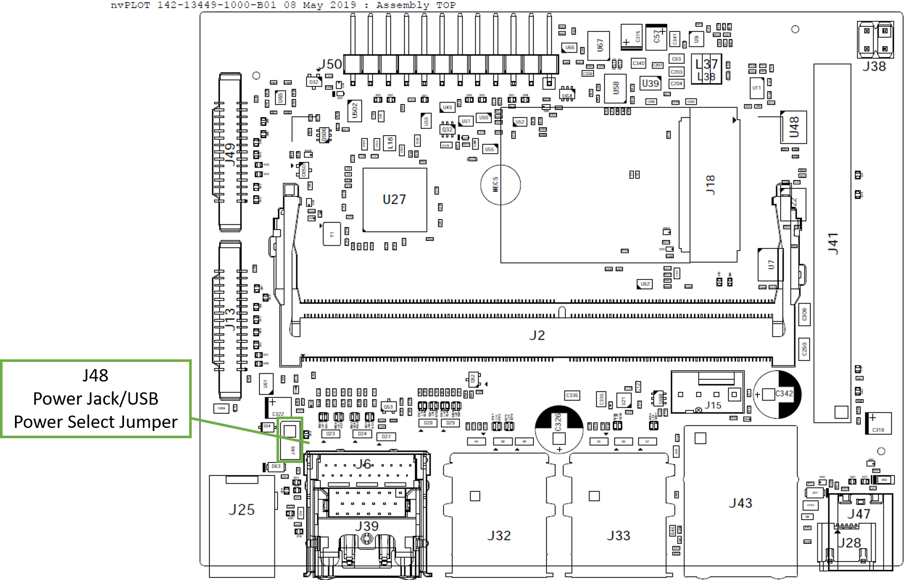
</p>

2. Connect your DC barrel jack power supply (5V/4A). The Jetson Nano Developer Kit will power on and boot automatically.
3. A green LED next to the Micro-USB connector will light as soon as the developer kit powers on.

# Cameras

## Logitech C270 USB Webcam (recommended configuration)

This is very straightforward. Just plug in the USB connector into any of the Jetson Nano Developer Kit USB ports.

<p align="center">

</p>

## Raspberry Pi v2 Camera (Alternate Configuration)

1. If you want to try this lab with a RasBerry Pi v2 Camera, you will need to connect to the MIPI CSI port. Begin by unlatching the MIPI CSI connector. This loosens the "grip" of the connector by just a small amount.

<p align="center">
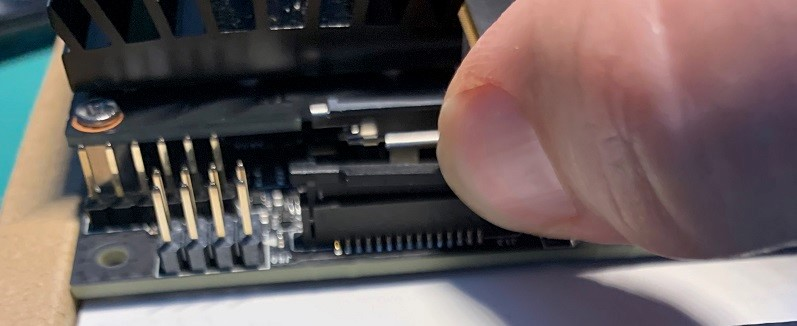
</p>

2. Insert the ribbon cable of the camera so that the metal side faces into the Nano board.

<p align="center">
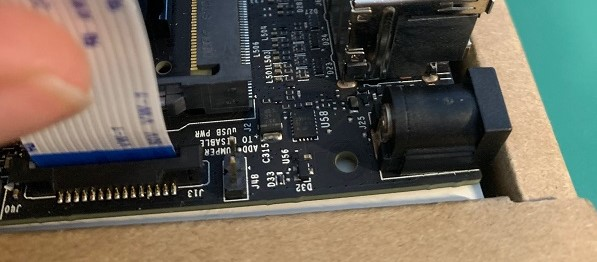
</p>

3. Latch the connector with a gentle push downward on the sides of the plastic. The ribbon cable should be securely held by the connector

<p align="center">
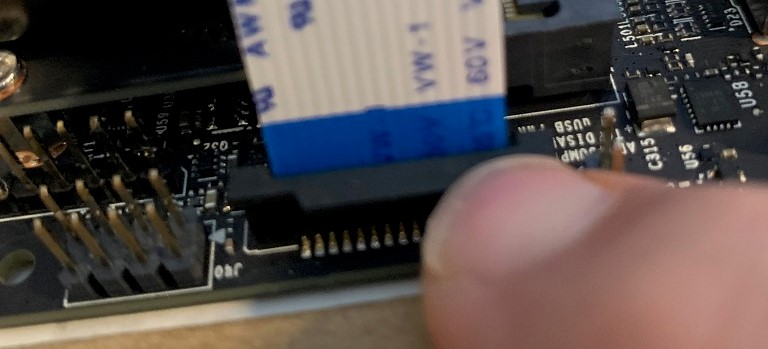
</p>

4. Remove the protective film from the lens of the camera.

<p align="center">

</p>

## Other cameras

Other cameras may also work with your Jetson Nano Developer Kit. You'll need to test them to find out. If you have another camera on hand, such as a USB webcam, feel free to give it a try using the "Hello Camera" test notebooks.

# Headless Device Mode

## Download Docker and Start JupyterLab

## Headless Device Mode

For this course, we are running the Jetson Nano Developer Kit in a <strong>"headless"</strong> configuration. That means you do not hook up a monitor directly to the Jetson Nano Developer Kit. This method conserves memory resources on the Jetson Nano and has the added benefit of eliminating the requirement for extra hardware, i.e. a monitor, keyboard, and mouse.

In addition, we will further simplify the configuration by using <strong>"USB Device Mode"</strong>. In this mode, your Jetson Nano Developer Kit connects directly to your computer through a USB cable. This eliminates the need for a network connection on the Jetson Nano, as well as the need to determine the IP address on your network. It is always `192.168.55.1`in this mode.

In the the steps that follow, you'll boot your Nano and log on from your computer with [SSH protocol](https://www.ssh.com/ssh/protocol/), a common method for communicating with embedded systems like the Jetson Nano. The course notebooks are included in a Docker container environment, which will be downloaded from the Internet and stored on your microSD card.

<p align="center">

</p>

## Setup Steps

1. Connect your flashed JetPack microSD card and power supply (DC barrel jack for 4G kit, USBC connector for 2G kit). The Jetson Nano Developer Kit will power on and boot automatically.
2. A green LED next to the Micro-USB connector will light as soon as the developer kit powers on. Wait about 30 seconds. Then connect the USB cable from the Micro USB port on the Jetson Nano Developer Kit to the USB port on your computer.
3. Connect your USB camera to a USB port on the Jetson Nano.<em>(If using the alternate CSI camera, connect it to the CSI port.)</em>
4. If you are downloading the Docker container with the course notebooks in it for the first time, connect your Nano to the Internet using the Ethernet port or a compatible WiFi device.
5. On your computer, open a terminal window if using Mac or Linux, and a PowerShell window if using Windows. In the terminal, log on to the Jetson Nano with the following command, where `<username>` is the values you set up on your Nano during the operating system configuration:

```sh
ssh <username>@192.168.55.1
```

Enter the password you configured when asked.

6. Add a data directory for the course with the following command in the Jetson Nano terminal you've logged into:

```sh
mkdir -p ~/nvdli-data
```

7. Run the Docker container with the following command, where `<tag>` is a combination of the course version and Jetson Nano JetPack L4T operating system version (form is `<tag> = <course_version>-<L4T_version>`). A list of tags can be found in the [course NVIDIA NGC cloud page](https://ngc.nvidia.com/catalog/containers/nvidia:dli:dli-nano-ai).

```sh
sudo docker run --runtime nvidia -it --rm --network host \
    --volume ~/nvdli-data:/nvdli-nano/data \
    --device /dev/video0 \
    nvcr.io/nvidia/dli/dli-nano-ai:<tag>
```

To create and run a reusable script for this step try the following (example tag shown):

```sh
# create a reusable script
echo "sudo docker run --runtime nvidia -it --rm --network host \
    --volume ~/nvdli-data:/nvdli-nano/data \
    --device /dev/video0 \
    nvcr.io/nvidia/dli/dli-nano-ai:v2.0.2-r32.7.1" > docker_dli_run.sh

# make the script executable
chmod +x docker_dli_run.sh

# run the script
./docker_dli_run.sh
```

If using the alternate CSI camera instead of the USB webcam, add `--volume /tmp/argus_socket:/tmp/argus_socket` to your docker run command. For example:

```sh
# create a reusable script
echo "sudo docker run --runtime nvidia -it --rm --network host \
    --volume ~/nvdli-data:/nvdli-nano/data \
    --volume /tmp/argus_socket:/tmp/argus_socket \
    --device /dev/video0 \
    nvcr.io/nvidia/dli/dli-nano-ai:v2.0.2-r32.7.1" > docker_dli_run.sh

# make the script executable
chmod +x docker_dli_run.sh

# run the script
./docker_dli_run.sh
```

If using the alternate CSI camera AND the 2GB version, also add `--memory=500M --memory-swap=4G` to your docker run command. For example:

```sh
# create a reusable script
echo "sudo docker run --runtime nvidia -it --rm --network host \
    --memory=500M --memory-swap=4G \
    --volume ~/nvdli-data:/nvdli-nano/data \
    --volume /tmp/argus_socket:/tmp/argus_socket \
    --device /dev/video0 \
    nvcr.io/nvidia/dli/dli-nano-ai:v2.0.2-r32.7.1" > docker_dli_run.sh

# make the script executable
chmod +x docker_dli_run.sh

# run the script
./docker_dli_run.sh
```

## Logging into the JupyterLab server

1. Open the following link address : [192.168.55.1:8888](http://192.168.55.1:8888/). The JupyterLab server running on the Jetson Nano will open up with a login prompt the first time.
2. Enter the password: `dlinano`

You will see this screen. Congratulations!

<p align="center">
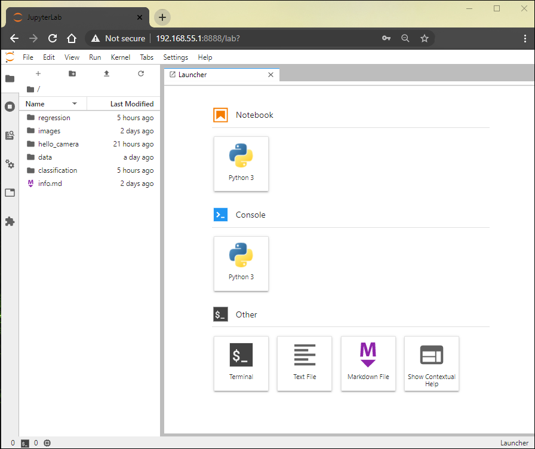
</p>

# Hello Camera

## Open the Hello Camera Notebook

The [JupyterLab](https://jupyterlab.readthedocs.io/en/stable/) interface is a dashboard that provides access to the Jupyter interactive notebooks. The first view you'll see includes a directory tree on the left and a "Launcher" page on the right. To open the "Hello Camera" notebook:

1. Navigate to the `hello_camera` folder with a double-click

<p align="center">
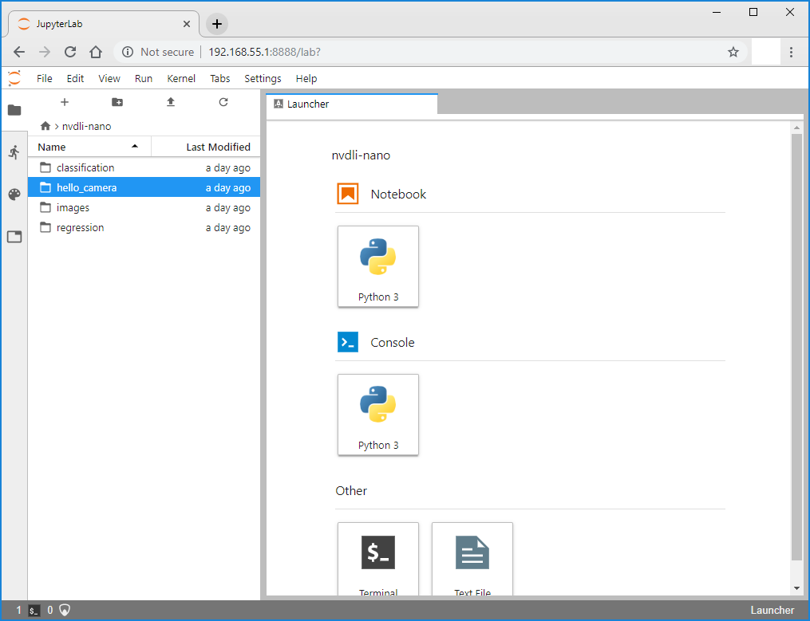
</p>

1. Double-click the `usb_camera.ipynb` notebook to open it.

<p align="center">
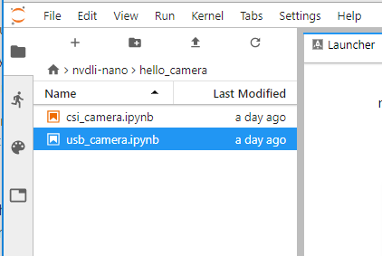
</p>

3. Find out more about JupyterLab in the next section. If you are already familiar with JupyterLab features, go ahead and jump right in! When you're satisfied that your camera works correctly, return here for project instructions.

<p align="center">
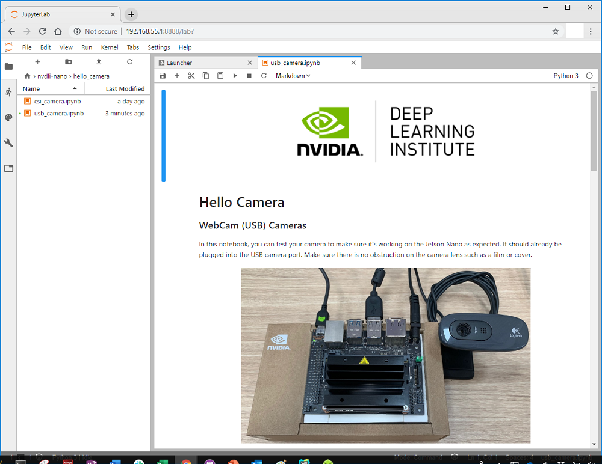
</p>

# JupyterLab

For this course, your Docker container has been configured to run a JupyterLab server on port `8888`. When you boot the container and open a browser to the Jetson Nano IP address at that port, you see the [JupyterLab](https://jupyterlab.readthedocs.io/en/stable/) interface.

## JupyterLab Interface

The JupyterLab Interface is a dashboard that provides access to interactive Jupyter notebooks, as well as a terminal window into the Ubuntu operating system. The first view you'll see includes a <strong>menu bar</strong> at the top, a directory tree in the <strong>left sidebar</strong>, and a <strong>main work area</strong> that is initially open to the "Launcher" page.

<p align="center">
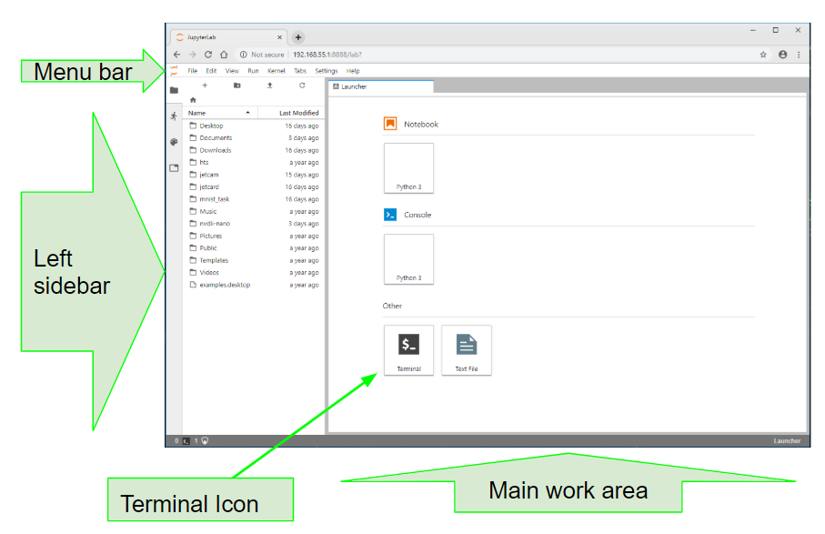
</p>

Complete details for all the features and menu actions available can be found in the [JupyterLab Interface](https://jupyterlab.readthedocs.io/en/stable/user/interface.html) document. Here are some key capabilities that will be especially useful in this course:

<h3>File browser:</h3>

The file browser in the left sidebar allows navigation through the Docker container file structure. Double-clicking on a notebook or file opens it in the main work area.

<h3>Jupyter notebooks:</h3>

The interactive notebooks used in this course have an ".ipynb" file extension. When a notebook is double-clicked from the file browser, it will open in the main work area and its process will start. The notebooks consist of text and code "cells". When a code cell is "run", by clicking the run button at the top of the notebook or the keyboard shortcut `[CTRL][ENTER]`, the block of code in the cell is executed and the output, if there is any, appears below the cell in the notebook. To the left of each executable cell there is an "execution count" or "prompt number" in brackets. If the cell takes more than a few seconds to run, you will see an asterisk mark there, indicating that the cell has not finished its execution. Once processing of that cell is finished, a number will show in the brackets.

<p align="center">
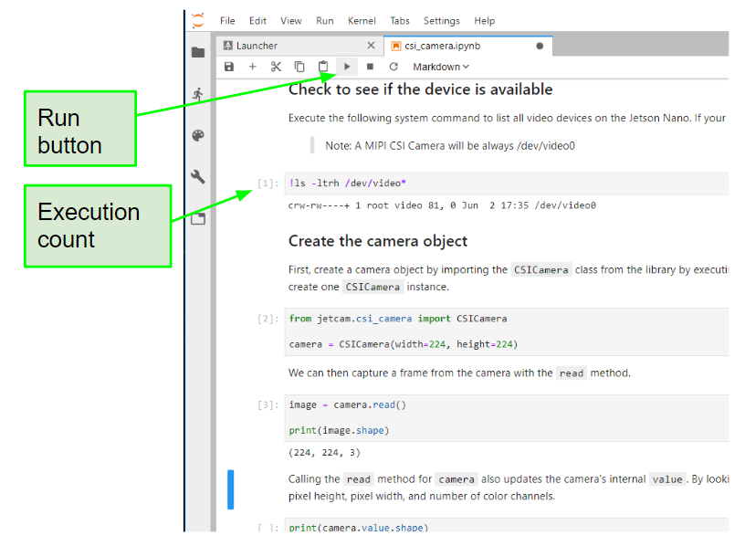
</p>

<h3>Kernel operations:</h3>

The kernel for each running notebook is a separate process that runs the user code. The kernel starts automatically when the notebook is opened from the file browser. The kernel menu on the main menu bar includes commands to shutdown or restart the kernel, which you will need to use periodically. After a kernel shutdown, no code cells can be executed. When a kernel is restarted, all memory is lost regarding imported packages, variable assignments, and so on.

<p align="center">

</p>

<h3>Cell tabs:</h3>

You can move any cell to new window tabs in the main work area by right-clicking the cell and selecting "Create New View for Output". This way, you can continue to scroll down the JupyterLab notebook while still watching a particular cell. This is especially helpful in the cell includes a camera view!

<p align="center">

</p>

<h3>Terminal window:</h3>

You can work directly in a Terminal window on your Docker container OS. From the Launcher page, click the Terminal icon under "Other". To bring up the Launcher page, if it is no longer visible, click the "+" icon at the top of the left sidebar.

<p align="center">
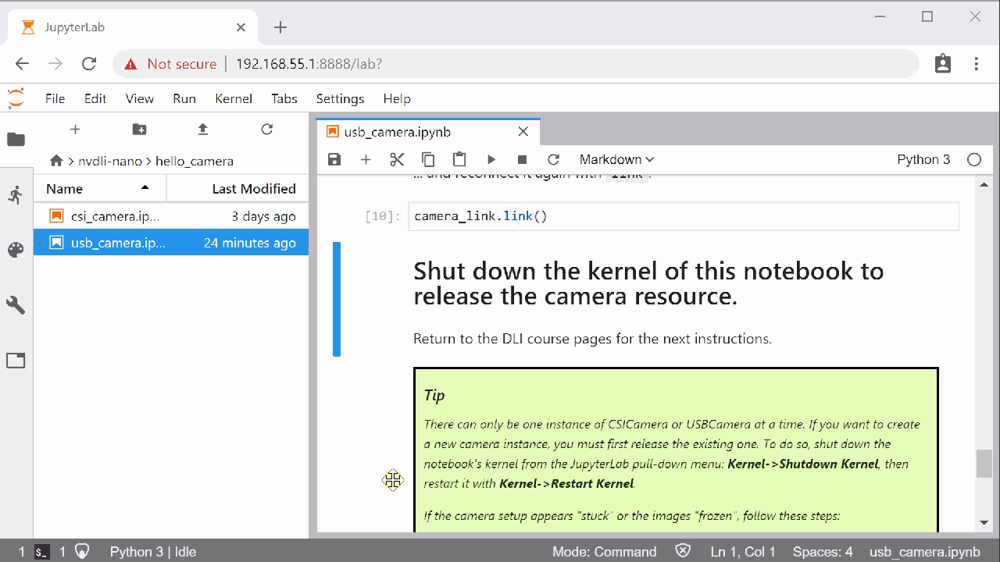
</p>
